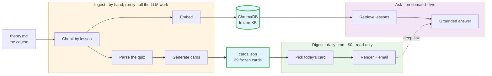

# 🎸 Guitar Digest RAG

I took a guitar-theory course I care about, turned it into a small RAG system, and gave
myself two ways to keep the material from fading: one question emailed to me every
morning, and a box where I can ask the course anything.

**[Try the live demo →](https://guitar-digest-rag-m2crd3rgefjrjqpeabumha.streamlit.app)**
— ask my guitar theory a question and it answers from the exact lesson the answer lives in.

## Why I built this

The source is [_Absolutely Understand Guitar_](https://absolutelyunderstandguitar.com/)
by Scotty West, who teaches music as a language first — patterns and spellings before
finger shapes — rather than in the usual order. I didn't want to watch the lessons once
and forget them. It also happens to fit RAG well: each part ends with a review quiz, so
the course hands me a ready-made set of human-written questions to use as both the daily
deck and the evaluation set.

> The course text lives in `theory.md`. This is a personal study project — all the
> teaching and content are Scotty West's; go buy the actual course, it's good.

## How it's built — three clocks

Everything reads from one frozen copy of the course. Three separate jobs touch it, and
they run at completely different rhythms:

- **Ingest** is the expensive part, and I run it by hand only when the course changes. It
  does all the LLM work up front — chunk the course by lesson, embed each chunk into a
  vector store, and generate the review cards — then freezes the results (`chroma/`,
  `cards.json`) straight into the repo.
- **Digest** is the daily email. It just reads the frozen cards, picks one, and mails it.
  No model calls at all, so it runs on a free GitHub Actions cron and costs nothing.
- **Ask** is the live part. It embeds your question, pulls the handful of most relevant
  lessons, and answers from them.

The two paths meet in one place: every Digest email links back to Ask with the day's
question pre-loaded, so a card you got in the morning is one click from a follow-up.



## The three parts up close

### Ingest — `guitar_digest/ingest/`

Run by hand, costs a few cents, and only when the course itself changes:

1. Split `theory.md` on `## Lesson` so each chunk is one whole lesson (10 lessons, plus
   the Lesson 11 review quiz).
2. Embed each lesson with `text-embedding-3-small` into a persistent ChromaDB collection,
   keeping the lesson number and title as metadata.
3. Pull the 29 questions out of the Lesson 11 quiz.
4. For each question, retrieve the relevant lessons and let `gpt-4.1-mini` write a
   grounded answer. The output is a Pydantic model (`question`, `answer`, `source`), so
   it comes back structured rather than as free text.
5. Freeze all 29 cards into `cards.json`. Nothing regenerates them unless I re-ingest.

```bash
uv run python -m guitar_digest.ingest    # rebuilds chroma/ and cards.json
```

### Digest — `guitar_digest/digest/`

The scheduler is deliberately dumb: `cards[(today - START_DATE).days % len(cards)]`. It's
just a rotating deck with no state to store, which means it's still correct on a fresh CI
runner that remembers nothing from yesterday. The email puts the question at the top and
the answer far below a gap of whitespace — not a collapsible — so you actually try to
recall it before you scroll. Delivery is plain Gmail SMTP.

```bash
uv run python -m guitar_digest.digest    # sends today's card
```

### Ask — `guitar_digest/ask.py` + `streamlit_app.py`

`ask(question)` embeds the question, retrieves the top lessons from the frozen KB (it only
ever reads `chroma/`, never rebuilds it), and answers under a strict prompt: use only the
excerpts, cite exactly one lesson, and if the answer isn't in them, say so instead of
guessing. Since the Streamlit demo is public, it also caps question length and rate-limits
requests so it can't quietly run up an OpenAI bill.

```bash
uv run python -m guitar_digest.ask "What is timbre?"   # quick CLI check
uv run streamlit run streamlit_app.py                  # local demo
```

## Does it actually work?

The obvious test set was already in the box: the course's own Lesson 11 quiz, 29 questions
written by a human. I ran every one through the live `ask()` and had `gpt-4.1-mini` grade
the answers — but not against its own output. The reference answers in `golden.json` were
written by a _different_ model (Claude) and reviewed by me, so the system isn't grading its
own homework; the answerer, the reference author, and the judge are three separate parties.

|                                                     | Result             |
| --------------------------------------------------- | ------------------ |
| Answers judged correct against the reference        | **29 / 29 (100%)** |
| Answers that cited the same lesson as the reference | **28 / 29 (96%)**  |

The grounding check is harsher than it needs to be — it counts a miss any time retrieval
cites a _different_ lesson than the golden set, even when that lesson also supports the
answer, which is exactly what the single miss is. Full per-question breakdown lives in
[`eval_report.md`](./eval_report.md).

```bash
uv run python -m guitar_digest.eval    # regenerates eval_report.md
```

## Layout

```
guitar_digest/
├── ask.py              # the live, single-turn RAG — the heart of the pull path
├── ingest/             # the one-time pipeline; all LLM work lives here
│   ├── pipeline.py     #   chunk → embed → parse quiz → generate cards
│   ├── parsing.py      #   lessons + Lesson 11 quiz extraction
│   ├── retrieval.py    #   builds the ChromaDB knowledge base
│   ├── cards.py        #   RAG card generation
│   ├── models.py       #   Pydantic schemas (GroundedAnswer, Card)
│   └── config.py       #   models, paths, top-k, the grounding prompt
├── digest/             # the daily email; read-only, no LLM
│   ├── scheduler.py    #   the stateless rotating deck
│   ├── render.py       #   the recall email + deep-link back to Ask
│   └── mailer.py       #   Gmail SMTP
└── eval/               # the LLM-as-judge harness
    ├── judge.py        #   grade a live answer against the golden set
    └── report.py       #   writes eval_report.md

streamlit_app.py        # the public Ask demo (rate-limited)
theory.md               # the course text (PDF → Markdown, done separately)
cards.json              # the frozen review deck — committed on purpose
chroma/                 # the frozen vector KB    — committed on purpose
golden.json             # independent reference answers for the eval
.github/workflows/digest.yml   # the daily cron
```

## Running it yourself

You'll need Python 3.12+, [uv](https://docs.astral.sh/uv/), an OpenAI key, and — only if
you want the daily email — a Gmail app password.

```bash
uv sync
cp .env.example .env    # then fill it in
```

```bash
# .env
OPENAI_API_KEY=sk-...
GMAIL_USER=you@gmail.com
GMAIL_APP_PASSWORD=your_gmail_app_password
```

Because `chroma/` and `cards.json` are committed, Ask and Digest both work straight away —
you only need to run Ingest if you change the course.

## Deploying

Ask runs on Streamlit Community Cloud, with the OpenAI key in the app's secrets and a hard
monthly spend cap set on the OpenAI side (plus the in-app rate limit). Digest runs as a
GitHub Actions cron (`.github/workflows/digest.yml`, daily at 18:00 UTC, with a 10-minute
timeout so a stuck run can't burn free minutes). It reads `GMAIL_USER` and
`GMAIL_APP_PASSWORD` from repo secrets, and since it never calls a model, it costs nothing.

## Stack

Python 3.12 with uv · OpenAI (`gpt-4.1-mini` for answers, cards, and the judge;
`text-embedding-3-small` for embeddings) · ChromaDB for the vector store · Pydantic for
structured output · Streamlit for the demo · GitHub Actions for the cron · Gmail SMTP.

## Where I'd take it next

- Do the PDF ingestion inside the pipeline, diagrams and all, instead of as a separate step
- Let what I Ask feed back into what the Digest sends me
- Swap the hand-rolled eval for RAGAS metrics
- Put real spaced repetition (SM-2) behind the scheduler instead of a plain rotation
- Add Part 2 of the course

---

\*Credit where it's due: the theory, the method, and every word of the source belong to
Scotty West's [Absolutely Understand Guitar](https://absolutelyunderstandguitar.com/).
